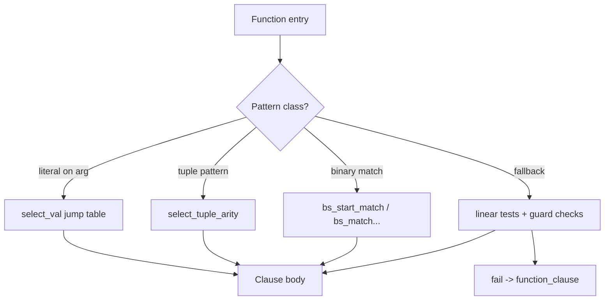

# Understanding the Elixir and Erlang Compiler

## Executive summary

A library that generates *many* `def`/`defp` clauses at compile time stresses **two compilers**: the Elixir front-end (parsing -> quoting -> macro expansion -> translation), and the Erlang/OTP back-end (Core Erlang / Kernel Erlang / BEAM SSA passes -> BEAM assembly and validation). The slowdowns you see are usually dominated by one of three costs:

1. **Elixir compile-time work**: macro expansion that creates a very large quoted AST, repeated expansions, per-definition callbacks, and large compile-time data structures. Elixir’s own docs emphasize that macros run at compile time and should be kept small; heavy work should move into runtime functions. 
2. **Erlang/OTP compiler work**: pattern-matching compilation and the BEAM SSA optimization/codegen pipeline. Official Erlang/OTP release notes explicitly acknowledge that *function heads or `case` expressions with a huge number of clauses* can cause the compiler to spend “an inordinate amount of time” compiling. 
3. **Code size and load-time effects**: a mega-module produces a large `.beam` (more instructions, larger literal tables, line tables, debug info), which increases compile memory, disk I/O, and load-time overhead. Tools like `beam_lib:strip/1` exist specifically to remove debug chunks. 

The most consistently effective optimization pattern, when you’re generating thousands+ of clauses, is to **stop generating clauses** and instead generate **data + a small dispatcher**:

- Put the generated mapping in a runtime structure optimized for lookup (often `:persistent_term` for read-heavy / rarely-updated tables, or ETS for mutable/large tables), and generate one or a few functions that do lookup. `persistent_term` is explicitly documented as constant-time lookup with no heap copying, traded off against expensive updates that trigger global GC. 
- If you must stay with clause-based dispatch, restructure to maximize compiler indexing opportunities (`select_val` / `select_tuple_arity`) and consider **module sharding** (many smaller modules) to reduce worst-case compilation passes on one giant function. The BEAM compiler uses `select_*` instructions for indexing, and `v3_kernel` is historically where pattern matching compilation happens. 

Concretely, you should first *measure where the time goes* using Mix’s built-in compile profiling and (if needed) Erlang compiler pass timing, then pick the least invasive redesign that collapses clause count by 10–100×. Mix provides `mix compile.elixir --profile time` and long-compilation thresholds/tracers. 


### Elixir’s front-end pipeline

Elixir source code is tokenized and parsed into a quoted representation (AST-like tuples), then macro-expanded, then translated into Erlang abstract forms and handed off to the Erlang compiler. This is visible directly in Elixir’s official guides and in Elixir’s own compiler source.

- The “Quote and unquote” guide documents the internal representation of a call such as `sum(1,2,3)` as a tuple `{:sum, [], [1,2,3]}` and frames `quote`/`unquote` as the core metaprogramming mechanism. 
- In Elixir’s source, `string_to_tokens/5` calls `elixir_tokenizer:tokenize/4`, and `quoted_to_erl/2` shows the “expand then translate” structure: expand (`elixir_expand:expand`) then translate (`elixir_erl_pass:translate`). 
- In `elixir_compiler.erl`, both interpretation and compilation of quoted code begin with `elixir_expand:expand`, then translation to Erlang expressions, then either evaluation or compilation. 

A useful conceptual pipeline is:

```mermaid
flowchart LR
  A[Elixir source .ex/.exs] --> B[Tokenizer]
  B --> C[Parser]
  C --> D[Quoted Elixir form / AST tuples]
  D --> E[Macro expansion (elixir_expand)]
  E --> F[Translate to Erlang abstract forms (elixir_erl_pass)]
  F --> G[Erlang/OTP compiler (Core/Kernel/SSA)]
  G --> H[BEAM bytecode (.beam)]
```

The critical implication for compile-time generators: every generated clause exists as **quoted Elixir data** *and* later as **Erlang IR and BEAM code**, multiplying memory/CPU costs across stages. 

### Where Elixir hands off to Erlang/OTP

Elixir does not implement its own BEAM backend; it drives the Erlang compiler.

- `elixir_erl_compiler:noenv_forms/3` converts Erlang forms to Core (`erl_to_core/2`) and then invokes `compile:noenv_forms/2` with `from_core`, producing a BEAM binary.   
- The same module uses `v3_core:module/2` directly when no parse transforms are present (and otherwise uses an internal `to_core0` path), illustrating that Elixir leans on the standard v3 compiler pipeline.   
- Elixir also isolates compilation work in a monitored spawned process (via `spawn_monitor`) in `elixir_erl_compiler:spawn/1`, then propagates results/diagnostics back to the parent. This matters because huge generated code can cause large heaps and GC pressure inside the compiler worker.   

### Erlang/OTP compiler pipeline and modern BEAM SSA backend

The Erlang/OTP team has published multiple official explanations of the compiler pipeline:

- The BEAM compiler history article describes the traditional `v3` pipeline, including `v3_core` and (critically for your use case) that **`v3_kernel` does pattern matching compilation** (historically like `v2_match`). 
- The “OTP 22 highlights” post explains that OTP 22 re-implemented lower levels of the compiler and inserted a new IR, **BEAM SSA**, resulting in a pipeline described as:  
  `Erlang AST -> Core Erlang -> Kernel Erlang -> Beam SSA -> Beam Asm`.
- The `beam_ssa_pre_codegen.erl` module header comment documents that this pass prepares SSA for codegen and performs register allocation, including a linear-scan algorithm and binary matching lowering toward BEAM-like instructions.

At a high level, the compiler stages are:

```mermaid
flowchart LR
  A[Erlang abstract format AST] --> B[Core Erlang (v3_core)]
  B --> C[Core optimizations (sys_core_fold etc.)]
  C --> D[Kernel Erlang + pattern compilation (v3_kernel)]
  D --> E[BEAM SSA + SSA opts]
  E --> F[SSA pre-codegen: reg alloc, lowering]
  F --> G[BEAM codegen + clean/jump/trim]
  G --> H[BEAM assembler emits chunks: AtU8, LitT, line tables...]
```

The takeaway: generating many clauses inflates **pattern compilation** work and also can blow up SSA optimization and trimming passes downstream.   

## Elixir macro expansion and compile-time evaluation semantics

### Macro expansion model and why large generated AST is costly

Elixir macros execute during compilation, transforming quoted forms into other quoted forms. Elixir’s macro guide stresses several properties that matter for performance:

- Macros are **lexical**, **explicit**, and clearly delimited by `quote`/`unquote`.   
- The guide’s performance-oriented advice is explicit: keep macros and quoted contents minimal and move work to regular functions where possible.   

When you generate thousands of clauses, you are effectively building a very large quoted structure that must be:

1. Allocated and traversed repeatedly during expansion,
2. Stored/rewritten with metadata (lines, file, context),
3. Translated into Erlang forms.

The `elixir_expand.erl` code around `quote` handling shows how options like `bind_quoted`, `generated`, and location handling complicate and expand work; expansion is not just a simple tree walk.   

### Compile-time evaluation and compilation in Elixir internals

Elixir has internal code paths for evaluating or compiling quoted code, which are relevant if your library uses `Code.eval_quoted`, `Module.eval_quoted`, dynamically builds modules, or does heavy computations at compile time.

- In `elixir_compiler.erl`, `interpret/3` expands quoted code, translates it, and then evaluates it via `elixir:erl_eval`, after building a binding map for variables.   
- `compile/4` similarly expands and translates, then spawns a compilation worker to compile forms to a BEAM binary (`elixir_erl_compiler:noenv_forms`), loads it (`code:load_binary/3`), and dispatches into it.   

This means compile-time generators that call evaluation helpers can trigger extra compilation cycles, extra code loading, and much larger temporary heaps than a “simple macro that returns AST”.   

### Module attributes and compile-time callbacks that can accidentally amplify work

Elixir’s docs are very explicit about module attributes and compilation hooks:

- Module attributes serve as annotations, temporary compile-time storage, and compile-time constants.   
- `@before_compile` can inject code at the end of a module *before* the compilation starts. If you generate code here, you are doing so at a sensitive point when definitions are being concretized and callbacks run sequentially.   
- `@after_compile` receives the produced bytecode; `@after_verify` runs after verification and is not expected to raise. These are useful for instrumentation but can be misused in ways that add compile-time overhead.   

For “many clause” generators, two practical pitfalls recur:

- If you rely on per-definition hooks (`@on_definition`) or heavy doc/spec machinery inside generated clauses, you may accidentally run O(N) expensive operations *per clause*, turning compilation into O(N²) behavior. (The mechanism is documented; the performance outcome is a consequence you should test with profiling.)   
- If your generator uses `quote`/`unquote_splicing` to splice very large lists of clauses, you are constructing huge intermediate lists and AST nodes; Elixir’s own expansion logic around quoting shows how it must track context, location, and binding rewriting.   

## How function clauses become BEAM and why “too many clauses” hurts

### Clause dispatch and BEAM indexing primitives

In BEAM, a function with multiple clauses is compiled into a single entry point that performs pattern tests and jumps to bodies. When the patterns permit it, the compiler emits specialized “select” instructions to implement efficient indexing rather than linear scanning.

- The BEAM disassembler documents the role of `select_*` instructions and specifically calls out `{select_val,3}` and `{select_tuple_arity,3}` as BEAM “select” instructions used for indexing.   
- The BEAM instruction set is generated at build time by `beam_makeops`, which defines the *external generic* instruction set shared by compiler and runtime. This matters because performance characteristics (like whether a `select_val` exists and how it is encoded) are tied to instruction set generation and VM/compiler compatibility.   

A simplified dispatch flow looks like:



### Pattern matching compilation location in the compiler pipeline

Official sources tie pattern matching compilation to specific phases:

- The BEAM compiler history article states that the `v3_kernel` pass translates Core Erlang to Kernel Erlang and “also does pattern matching compilation.”   
- The OTP 22 compiler rewrite inserted BEAM SSA and “almost removed Kernel Erlang” as a primary IR, but the overall pipeline still includes Kernel Erlang conceptually before SSA and BEAM assembly, per the OTP 22 highlights post.   

So even in modern OTP, large clause sets primarily stress:
1) pattern compilation into decision structures, then  
2) SSA transformation/optimization and code size reduction passes.   

### Concrete evidence: binary matching + `select_val`

A recent official Erlang/OTP issue shows a minimal example where binary pattern matching produces a `select_val` on an extracted byte. It demonstrates the style of “indexing” you want for constant-key dispatch, but it also hints at how quickly code gets large as patterns scale.

In the issue, compiling with `erlc +to_asm` yields assembly that performs `bs_start_match3`, extracts an integer, then uses `select_val` to branch on byte values.   

### Why compile time can grow superlinearly

Official Erlang/OTP release notes explicitly call out your pain point:

- “For some function heads or `case` expressions with a huge number of clauses, the compiler could spend an inordinate amount of time compiling the code.”   

In practice, the cost comes from:

- building and optimizing large decision trees / SSA graphs,
- large register allocation problems and frame placement work (documented as part of SSA pre-codegen),   
- large post-codegen cleanup/trimming passes.

A dramatic example of pass dominance is captured in an OTP issue where compilation time is broken down by pass; for a very large file, passes like `beam_ssa_opt`, `beam_ssa_pre_codegen`, and `beam_trim` dominate total compile time.   

## Limits and performance characteristics that matter for large generated modules

### CPU and memory during compilation

Key official observations and mechanisms:

- The Erlang compiler provides `basic_validation` and `strong_validation` as fast “will it compile?” modes that *do not generate code*, specifically called out as “useful for code generators that want to verify the code that they emit.” This is directly relevant if your generator emits code and you want fast validation in tests/CI without paying full codegen costs.   
- The compiler can run in a separate process; `no_spawn_compiler_process` exists for tools that already handle their own worker processes and want to avoid extra spawning overhead.   
- Elixir itself wraps compilation work in a spawned process (monitored), which means compile-time giant ASTs can create large, short-lived heaps—good insofar as they die with the worker, but still expensive in CPU and peak memory.   

### BEAM size, debug info, and stripping

Large numbers of clauses increase:

- instruction count,
- literal tables (especially if you embed many constants),
- line tables (unless you remove line info),
- debug chunks.

Official documentation points you to relevant levers:

- `no_line_info` omits line number information to produce a slightly smaller output file.   
- `beam_lib:strip/1` removes debug chunks (`debug_info` and `abstract_code`) from BEAM files.   
- Elixir’s `@compile {:debug_info, false}` is possible but explicitly discouraged because it removes the ability of compiler/tools to analyze code; Elixir notes that release tooling strips debug info by default.   

### Code loading and build determinism knobs

While not unique to mega-modules, two official points are practical when benchmarking:

- `erlc` intentionally does **not** include the current working directory in the code path when running the compiler to avoid loading conflicting `.beam` files from CWD. This matters if your generator writes artifacts to the project root.   
- Compiler option ordering changed in Erlang/OTP 27+: the current docs note that option order (attribute vs passed options vs environment) is significant, and that OTP 26 and earlier had the opposite precedence order. This matters when you pass options via `@compile`, Mix, and `ERL_COMPILER_OPTIONS`.   

## Optimization strategies for compile-time generation of many clauses

This section is written to be directly actionable for the “generate many clauses into one module” design, with explicit tradeoffs and expected impact.

### Strategy selection table

The table below compares approaches you explicitly requested (compile-time clauses, runtime lookup, module splitting, and data structures). “Estimated impact” is qualitative because it depends heavily on clause count, pattern shape, and OTP/Elixir versions.

| Approach | Core idea | Pros | Cons | Estimated impact (compile time / runtime / BEAM size) |
|---|---|---|---|---|
| Massive compile-time clause generation | Emit `def f(k) when k==... -> ...` clauses | Best-case runtime dispatch can be very fast if compiler indexes via `select_val` ; very large `.beam` | Compile time: often worst; runtime: good; BEAM size: worst |
| Data + small dispatcher (Elixir) | Generate data (map/table), one `lookup/1` that uses it | Drastically fewer AST nodes and fewer BEAM blocks; macro can stay small (recommended by Elixir docs)  | Runtime performs a data lookup; must choose structure carefully | Compile time: large win; runtime: usually good; BEAM size: large win |
| `:persistent_term` backing store | Precompute table; store once; lookup is constant time, no heap copying  | Compile time: big win; runtime: excellent reads; BEAM size: small (mostly code) |
| ETS table lookup | Build ETS on load; lookup by key | `set` lookup is constant-time; `ordered_set` is O(log N) per Efficiency Guide  | Values copied to process heap (unlike `persistent_term`), and you must manage table lifecycle | Compile time: big win; runtime: good; BEAM size: small |
| Module sharding (split generated clauses into many modules) | Generate N modules with fewer clauses each + dispatcher | Reduces “one giant function” stress; can reduce worst-case compiler pass blowups (inference) | More modules to compile/load; runtime call indirection; complexity | Compile time: often good; runtime: slightly worse; BEAM size: spread across files |
| Binary trie / prefix dispatch | Generate a trie-like set of `case`/binary matches | Can reduce clause explosion for string/binary keys; can align with BEAM binary match optimizations  | Still code-heavy; careful design needed to avoid bad compiler paths | Compile time: medium win; runtime: good |
| Runtime code generation | Generate dispatch structure at runtime | Eliminates compile-time macro load; can adapt to runtime config | Startup time cost; less static checking; complexity | Compile time: best; runtime: depends; BEAM size: best |

### High-leverage tactics and patterns

#### Replace a large clause set with a lookup table

If your generated function is essentially a mapping (`key -> value` or `key -> handler`), a lookup table usually dominates clause generation.

**Option A: `:persistent_term` for read-heavy, rarely-updated tables**

What the official docs guarantee:

- Lookup is constant time, lock-free, and the value is not copied to the calling process heap.   
- Updates/deletes are expensive: they copy the hash table and can trigger a global GC scan across processes. The docs recommend infrequent updates, prefer fewer large terms over many small ones, and warn about responsiveness impacts.   

**Practical pattern** (conceptual):

- Generate a single large term (often a map) at compile time.
- Store it in one `:persistent_term` key at module load.
- Lookup in `lookup/1`.

This usually turns “10k clause bodies” into:
- one generated term,
- one `@on_load` initializer,
- one runtime lookup function.

Elixir’s `@on_load` hook is documented.   

**Option B: ETS for very large tables and/or tables that may change**

The Efficiency Guide explicitly states:

- A lookup by known key in an ETS `set` is constant time; in `ordered_set` it is O(log N).   

ETS can be created in an `@on_load` callback similarly; it trades raw read speed for mutability and for well-understood operational characteristics (table ownership, memory).   

#### If you must keep many clauses, force index-friendly shapes

When clause patterns allow it, BEAM emits `select_val` or `select_tuple_arity` indexing structures rather than linear tests. The disassembler documentation for `select_*` shows these exist specifically “for indexing.”   

Practical guidance (measure with disassembly):

- Prefer dispatch on **one extracted discriminant** (atom/integer/tuple arity), then handle the rest inside fewer branches.  
- Consider generating a **two-level dispatch**: first select on a small bucket (e.g., first byte, hash prefix, tuple tag), then handle collisions. This reduces single-function clause count while retaining strong runtime performance.

The binary-handling Efficiency Guide explains that the compiler uses a *match context* and performs optimizations to avoid unnecessary sub-binaries; well-structured binary dispatch can benefit from this machinery.   

#### Module sharding to cap worst-case compiler passes

When the root problem is “one module is enormous,” splitting generated clauses across multiple modules can reduce the cost of the worst-case SSA optimization and trimming passes on a single unit.

While this is partly an engineering inference, the motivation is supported by official evidence that some compiler passes can dominate compilation time for very large units (example pass timing output in OTP issue #5140).   

A common pattern is:

- `Dispatcher.lookup/1` chooses a shard (e.g., based on key prefix or hash range),
- `ShardNN.lookup/1` contains only the subset of clauses.

#### Use compiler tools designed for code generators

Two official Erlang compiler options are especially relevant in generator development loops:

- `basic_validation` and `strong_validation`: validate that a module compiles and produce warnings, but **generate no code**—explicitly described as useful for code generators.   
- `'S'`, `'E'`, `'P'`: produce listings of assembler / transformed code; `from_core` and `from_asm` support compiling from intermediate representations (noting formats are not documented and can change).   

These let you build a “fast feedback mode” that checks generator correctness without paying full BEAM generation costs every time.   

## Suggested experiments and microbenchmarks

The goal here is to isolate whether you are bottlenecked in: (A) macro expansion/front-end, (B) Erlang compiler passes, or (C) code size/load/runtime dispatch.

### Baseline compilation measurements

**Measure Elixir compilation step time**

Mix supports compile profiling:

```bash
# Force recompilation and show time breakdown
mix clean
mix compile --force --profile time
```

This is explicitly documented via `mix compile.elixir --profile` (with `time`).   

**Measure OS-level peak memory (RSS)**

On Linux:

```bash
/usr/bin/time -v mix clean
/usr/bin/time -v mix compile --force --profile time
```

On macOS (BSD time):

```bash
/usr/bin/time -l mix compile --force --profile time
```

(These are OS tools; interpret “Maximum resident set size” / similar fields.)

**Record artifacts**

- `.beam` size on disk:
  ```bash
  ls -lh _build/*/lib/*/ebin/Elixir.YourBigModule.beam
  ```
- Optional: strip debug chunks to understand their contribution:
  - `beam_lib:strip/1` is documented as removing debug info and abstract code chunks.   

### Erlang compiler pass profiling (when you can reproduce in Erlang)

If you can generate an equivalent Erlang module (even mechanically), Erlang tooling can provide deep insight.

- The Erlang compiler supports writing an assembler listing file `<File>.S` using the `'S'` option.   
- In practice, OTP developers and users often use `erlc +to_asm` to inspect output (as shown in an official Erlang/OTP issue).   
- A well-known (but not always prominently documented) diagnostic is `+time`, which prints per-pass compiler times; the output format is illustrated in issue #5140, including passes like `beam_ssa_opt` and `beam_trim`.   

Suggested commands (Erlang reproduction):

```bash
erlc +time +S big_generated.erl
```

Then inspect:
- which pass dominates,
- whether you see `select_val`/`select_tuple_arity` in the `.S` output.   

### Runtime dispatch benchmarks

You want to compare “many clauses” vs “lookup table” vs “sharded modules” at runtime.

Metrics to capture:

- operations/second for representative lookups,
- percentiles if you have skewed key distributions,
- reductions per call (optional),
- GC pressure if lookups allocate.

Suggested harness (conceptual steps):

1. Build a realistic distribution of keys (hot/cold).  
2. Benchmark:
   - `YourBigModule.lookup(key)` (many clauses),
   - `YourMapModule.lookup(key)` (single map/ETS/persistent_term),
   - `YourDispatcher.lookup(key)` (sharded).  
3. Run once with keys all distinct (cache-miss-ish), once with hot set.

If you use `:persistent_term`, validate you never update it per request: updates can trigger global GC and reduce responsiveness, per official docs.   

### Key experiments that usually identify “why compilation is slow”

1. **Clause count scaling test**: generate 1k / 5k / 10k / 50k clauses and plot compile time and peak RSS. If compile time scales worse than linear, assume pattern compilation / SSA passes are dominating (supported by OTP release notes acknowledging pathological compile times for huge clause counts).   
2. **Shape test**: keep the same number of clauses but change patterns to:
   - all first-arg integer literals,
   - all binary patterns,
   - mixed guards.  
   Then inspect BEAM assembly for `select_val` usage (the `beam_disasm` docs explain that `select_val`/`select_tuple_arity` are indexing instructions).   
3. **Debug info impact**: compile with and without debug info (where acceptable) and compare `.beam` size and compile time. Elixir documents `@compile {:debug_info, false}` but discourages it; `beam_lib:strip/1` exists for deployment artifacts.   

### Decision rule of thumb

- If `mix compile --profile time` shows most time in Elixir compilation itself, prioritize **shrinking macro output** and eliminating per-clause compile-time work (in line with Elixir macro guidance).   
- If Erlang pass timing (or symptoms like extremely slow back-end compilation) dominates, prioritize **reducing clause count** via table lookup or sharding, consistent with OTP release notes about huge clause sets.   
- If runtime dispatch is the only concern, aim for index-friendly dispatch (`select_val`) or a read-optimized structure like `:persistent_term`, whose read properties are explicitly documented. 